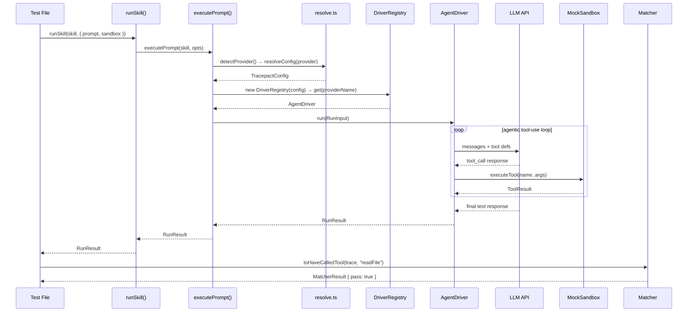
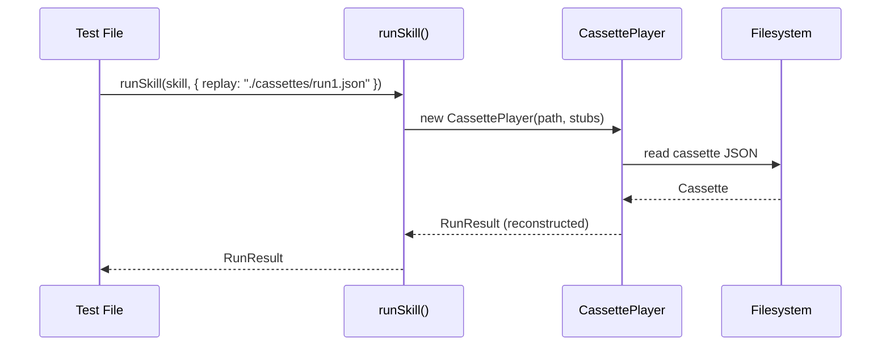
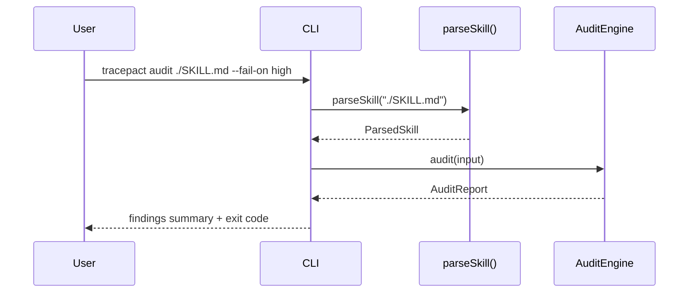
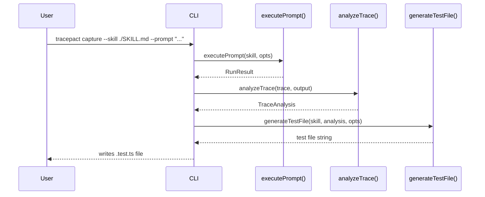

> **Sistema:** Tracepact — testing framework for LLM-powered skills (AI agents)
> **Este documento cubre:** Flujos de ejecución principales del sistema, paso a paso con diagramas
> **Índice general:** [index.md](./index.md)

# Execution Flows

Componentes referenciados: [components-drivers.md](./components-drivers.md) · [components-testing.md](./components-testing.md) · [components-tooling.md](./components-tooling.md)

---

### Flow: `runSkill()` — mock sandbox run (typical unit test)

**Trigger:** A Vitest test calls `runSkill(skill, { prompt, sandbox })` with `TRACEPACT_LIVE=1`

**Path completo:**

1. `packages/vitest/src/run-skill.ts:runSkill()` — checks `TRACEPACT_LIVE` env var; delegates to `executePrompt()`
2. `packages/core/src/driver/execute.ts:executePrompt()` — shared orchestration used by vitest and CLI
3. `packages/core/src/driver/resolve.ts:detectProvider()` → `resolveConfig(providerName)` — detects provider from env, merges defaults with user overrides
4. `packages/core/src/driver/registry.ts:new DriverRegistry(config)` → `registry.get(providerName)` — retrieves appropriate [`AgentDriver`](./components-drivers.md#agentdriver-interface). `DriverRegistry` instances are cached at the module level in `execute.ts` — subsequent calls reuse the same registry unless `tracepactConfig.providers` is overridden per-call.
5. `packages/core/src/driver/anthropic-driver.ts:AnthropicDriver.run()` (or `OpenAIDriver`) — enters agentic tool-use loop
6. For each tool call: `packages/core/src/sandbox/mock-sandbox.ts:MockSandbox.executeTool()` — dispatches to registered mock, records in `TraceBuilder`
7. Loop continues until no more tool calls in response
8. Returns `RunResult` to test with `output`, `trace`, `usage`
9. Test calls matcher: e.g., `packages/core/src/matchers/tier0/index.ts:toHaveCalledTool()` — asserts on `trace`

> **Nota:** `CacheStore` forma parte del flujo de `executePrompt()`. Antes de llamar al driver se hace un `cache.get(manifest)` — si hay hit, se retorna el resultado cacheado sin llamar al LLM. Después del driver call se hace `cache.set(manifest, result)`. `TRACEPACT_NO_CACHE=1` deshabilita ambos pasos. El cassette recording/replay se maneja vía `CassetteRecorder`/`CassettePlayer` dentro de `executePrompt()`.

---

### Flow: `runSkill()` — cassette replay

**Trigger:** `TRACEPACT_REPLAY=./cassettes` env var is set, or `replay` option passed to `runSkill()`

**Path completo:**

1. `packages/vitest/src/run-skill.ts:runSkill()` — detects `replay` path in config
2. `packages/core/src/cassette/player.ts:CassettePlayer.load()` — reads JSON cassette from disk
3. `packages/core/src/cassette/player.ts:CassettePlayer.replay()` — reconstructs `RunResult` from cassette, applies any stubs
4. Returns `RunResult` to test — no API call, no sandbox execution

---

### Flow: `tracepact audit <skill>` (CLI)

**Trigger:** User runs `tracepact audit ./SKILL.md`

**Path completo:**

1. `packages/cli/src/index.ts:createProgram()` — parses CLI args
2. `packages/core/src/parser/skill-parser.ts:parseSkill()` — reads file, extracts YAML frontmatter, computes SHA256 hash
3. `packages/core/src/audit/engine.ts:AuditEngine.auditSkill()` — runs all builtin rules against `ParsedSkill`
4. Rules: `toolComboRisk`, `promptHygiene`, `skillCompleteness`, `noOpaqueTools`
5. Formats output as JSON or summary, exits with non-zero if findings exceed `--fail-on` threshold

---

### Flow: `tracepact capture` — test scaffolding generation

**Trigger:** User runs `tracepact capture --skill ./SKILL.md --prompt "..."` to auto-generate a test file

**Path completo:**

1. `packages/cli/src/index.ts` — parses capture command
2. `packages/core/src/parser/skill-parser.ts:parseSkill()` — parses skill file
3. Either: loads cassette via `CassettePlayer.load()`, OR calls `executePrompt()` live if no cassette
4. `packages/core/src/capture/index.ts:analyzeTrace()` — infers assertions from tool trace
5. `packages/core/src/capture/index.ts:generateTestFile()` — renders a `.test.ts` file with inferred matchers

---

### Flow: MCP server tool call from IDE

**Trigger:** An AI IDE (e.g., Cursor) calls the `tracepact_audit` MCP tool

**Path completo:**

1. `packages/mcp-server/src/index.ts` — MCP server receives tool call via stdio
2. Tool handler for `tracepact_audit` is invoked with `{ skill_path: "./SKILL.md" }`
3. Calls `parseSkill()` + `new AuditEngine(BUILTIN_RULES).auditSkill()` from core
4. Returns JSON audit report to IDE
