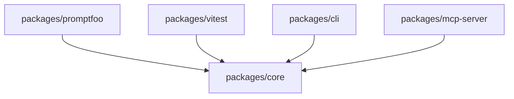

# Internal Import Graph

<!-- BEGIN:GENERATED -->
_Auto-generated from code — do not edit this block manually._

> Auto-extracted cross-package import dependencies

## Import table

| Package | Depends on |
|---------|------------|
| `packages/cli` | `packages/core` |
| `packages/mcp-server` | `packages/core` |
| `packages/promptfoo` | `packages/core` |
| `packages/vitest` | `packages/core` |
<!-- END:GENERATED -->
