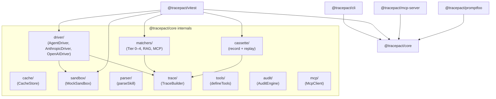

# Architecture — Tracepact

> Documentación modular generada a partir de `architecture.md`.
> Marcadores: `[OBSERVED]` = visto en código, `[INFERRED]` = deducido, `[UNCLEAR]` = no determinado.

## Executive Summary

Tracepact is a **testing framework for LLM-powered skills (AI agents)** — it lets developers define a "skill" (a system prompt + tool set), run it against a real or mocked AI provider, and assert on the resulting tool traces and outputs. The system is organized as a **TypeScript monorepo** with five packages: a core library, a CLI, a Vitest plugin, an MCP server, and a Promptfoo integration. Architecturally, the system follows a **layered adapter pattern**: a stable core domain (driver interface, matcher system, cassette I/O) surrounded by thin integration adapters (vitest plugin, CLI, MCP server). The codebase is well-structured and consistent; the main systemic risk is a **hard coupling between `@tracepact/vitest` and `@tracepact/core`** with no intermediate abstraction layer, and the **judge/semantic matcher subsystem** depends on live API calls with no fallback strategy.

## Mapa de navegación

| Documento | Qué encontrás ahí | Cuándo leerlo |
|-----------|-------------------|---------------|
| [shape.md](./shape.md) | Estructura del repo, diagrama de dependencias | Entender la organización general |
| [entrypoints.md](./entrypoints.md) | Puntos de entrada del sistema | Saber dónde arranca la ejecución |
| [components-drivers.md](./components-drivers.md) | `AgentDriver`, `AnthropicDriver`, `OpenAIDriver`, `DriverRegistry`, `RetryPolicy`, `Semaphore` | Entender el subsistema de providers |
| [components-testing.md](./components-testing.md) | `MockSandbox`, `Matcher System` (Tier 0–4), `CassetteRecorder/Player`, `CacheStore` | Entender el core de testing |
| [components-tooling.md](./components-tooling.md) | `AuditEngine`, `McpClient`, `tracepactPlugin`, `RedactionPipeline` | Entender herramientas y adapters de integración |
| [interfaces.md](./interfaces.md) | Contratos entre módulos | Entender los boundaries |
| [flows.md](./flows.md) | Flujos de ejecución con diagramas | Seguir un request/comando end-to-end |
| [dependencies.md](./dependencies.md) | Deps externas e internas | Evaluar footprint de dependencias |
| [wiring.md](./wiring.md) | DI, config, env vars, registries | Entender cómo se ensambla todo |
| [cross-cutting.md](./cross-cutting.md) | Error handling, auth, logging, validación, token budget | Concerns transversales |
| [tech-debt.md](./tech-debt.md) | Deuda técnica y riesgos | Priorizar mejoras |
| [inventory.md](./inventory.md) | Lista completa de módulos secundarios | Buscar algo específico |

## Diagrama de alto nivel

> El diagrama muestra los módulos principales de `@tracepact/core`. Módulos secundarios omitidos por claridad: `capture/`, `redaction/`, `config/`, `cost/`, `flake/`, `models/`, `scenarios/`, `errors/`, `calibration-sets/`. Ver [inventory.md](./inventory.md) para la lista completa.
