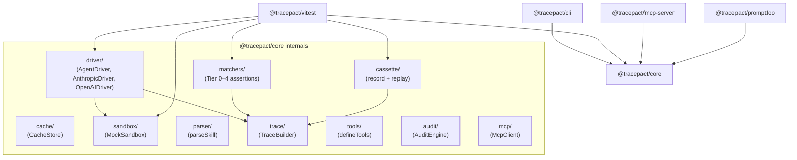

> **Sistema:** Tracepact — testing framework for LLM-powered skills (AI agents)
> **Este documento cubre:** Estructura de directorios del repositorio y diagrama de dependencias entre paquetes
> **Índice general:** [index.md](./index.md)

# Repository Shape

| Path | Tipo | Rol arquitectónico | Notas |
|------|------|--------------------|-------|
| `packages/core/` | Package | Core domain library | All primitives: driver, matchers, cache, cassette, sandbox |
| `packages/core/src/config/` | Module | Config schema + defaults | `defineConfig()`, `TracepactConfig` type |
| `packages/core/src/driver/` | Module | AI provider adapters | `AgentDriver` interface, `AnthropicDriver`, `OpenAIDriver`, `DriverRegistry` |
| `packages/core/src/matchers/` | Module | Assertion engine | Tiered matchers (Tier 0–4), RAG, MCP, conditional |
| `packages/core/src/cassette/` | Module | Record/replay I/O | `CassetteRecorder`, `CassettePlayer`, `diffCassettes` |
| `packages/core/src/cache/` | Module | Filesystem run cache | `CacheStore`, `RunManifest`, hash-based keying |
| `packages/core/src/sandbox/` | Module | Mock tool environment | `MockSandbox`, `mockReadFile`, `mockBash`, etc. |
| `packages/core/src/trace/` | Module | Tool call recording | `ToolTrace`, `TraceBuilder` |
| `packages/core/src/tools/` | Module | Tool definition DSL | `defineTools()`, Zod → JSON Schema bridge |
| `packages/core/src/mcp/` | Module | MCP client | `McpClient`, `connectMcp()` |
| `packages/core/src/parser/` | Module | Skill file parser | `parseSkill()`, frontmatter + hash |
| `packages/core/src/audit/` | Module | Static skill analysis | `AuditEngine`, builtin rules |
| `packages/core/src/capture/` | Module | Test scaffolding gen | `analyzeTrace()`, `generateTestFile()` |
| `packages/core/src/redaction/` | Module | Secrets scrubbing | `RedactionPipeline` |
| `packages/core/src/models/` | Module | Provider/model registry | `listProviders()`, `getRecommended()` |
| `packages/core/src/cost/` | Module | Token budget tracking | `TokenAccumulator` |
| `packages/core/src/flake/` | Module | Flaky test detection | `FlakeStore` |
| `packages/core/src/calibration-sets/` | Directory | Directorio de ejemplos de calibración custom (YAML) para el judge Tier 4 | Los ejemplos bundled (`code-review`, `deploy`, `documentation`) están hardcodeados en TypeScript en `matchers/tier4/calibration.ts` (`BUNDLED_SETS`); este directorio existe pero sus YAMLs no son consumidos por el código |
| `packages/core/src/scenarios/` | Module | Parameterized test loader | `loadScenarios()` |
| `packages/core/src/errors/` | Module | Error class hierarchy | `TracepactError`, `ConfigError`, `DriverError`, `SkillParseError` |
| `packages/core/src/logger.ts` | File | Logging | `log.{debug,info,warn,error}`, env-driven level |
| `packages/cli/` | Package | CLI entrypoint | `tracepact` binary, `commander`-based |
| `packages/vitest/` | Package | Vitest integration | Plugin, `runSkill()`, custom matchers, JSON reporter |
| `packages/mcp-server/` | Package | MCP server | Exposes 6 tools to agentic IDEs |
| `packages/promptfoo/` | Package | Promptfoo integration | `TracepactProvider`, assertion helpers |
| `package.json` | Root | Workspace definition | Node >=20, turbo build |
| `tsconfig.base.json` | Root | TS config base | ES2022, strict, ESM |
| `biome.json` | Root | Linter/formatter | Spaces, 100-char lines |
| `Makefile` | Root | Build automation | — |
| `.husky/pre-commit` | Root | Git hook | Runs `npx biome check --write . && git add -u && npm run typecheck && npm run build && npm test` |

